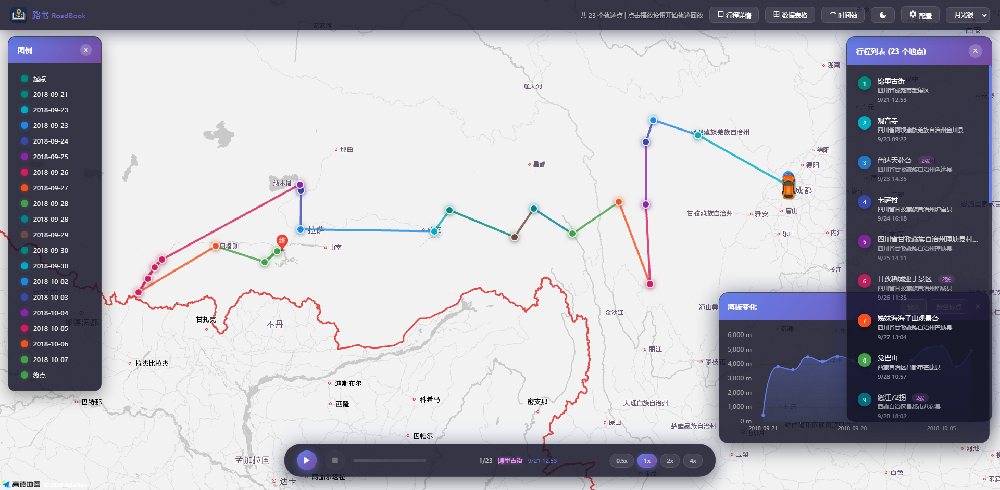
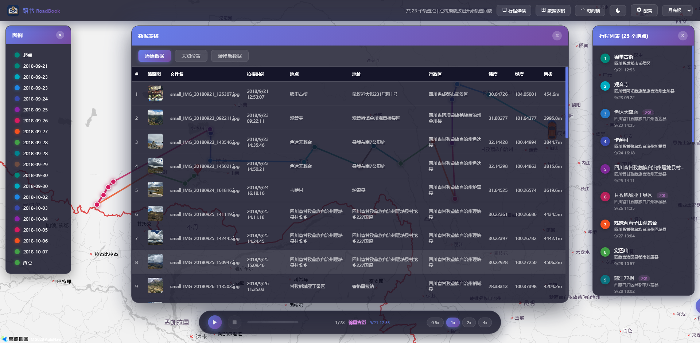
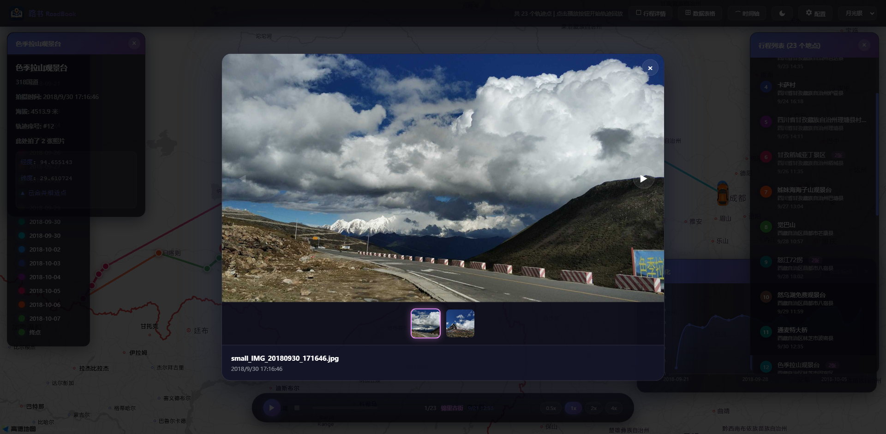
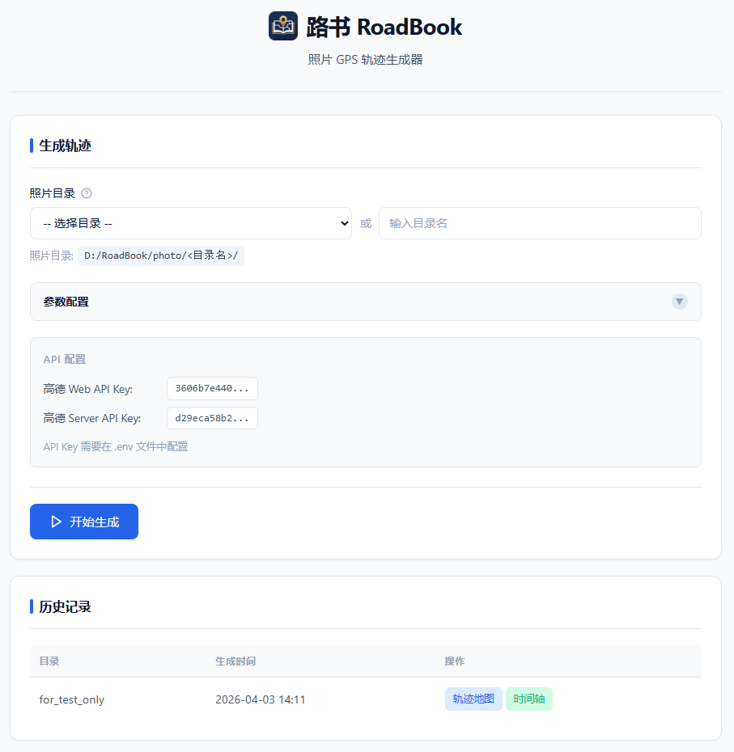
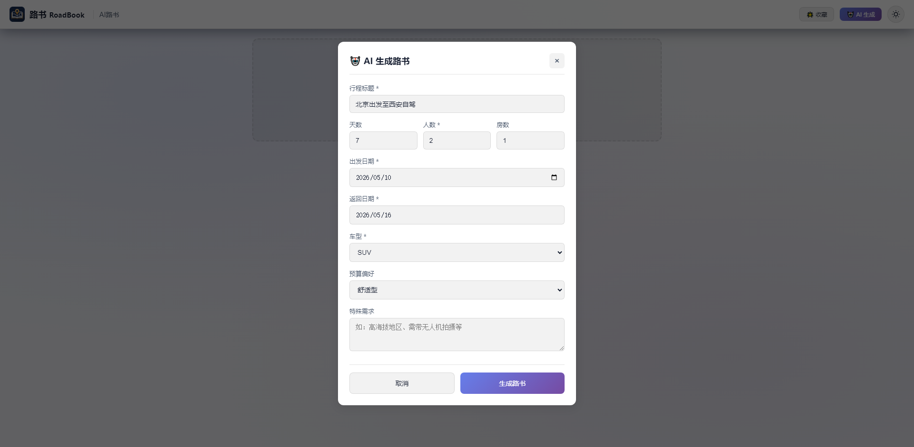
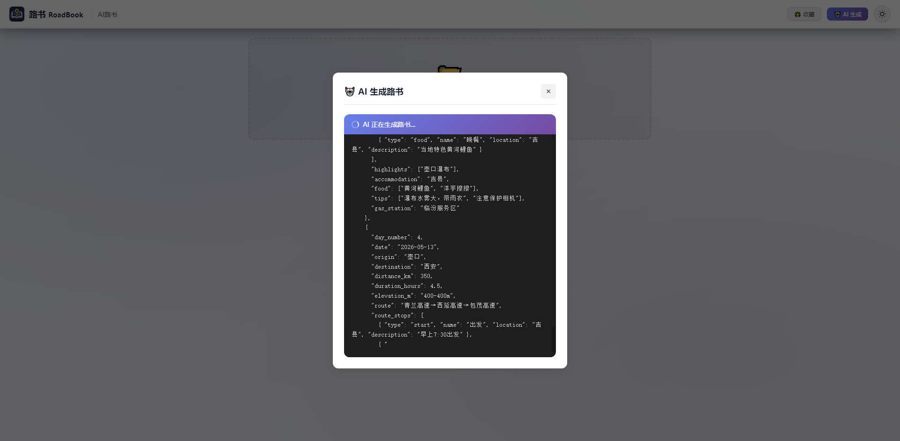
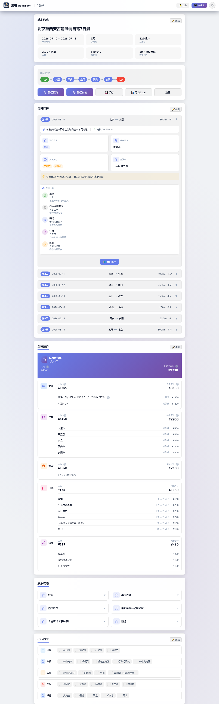
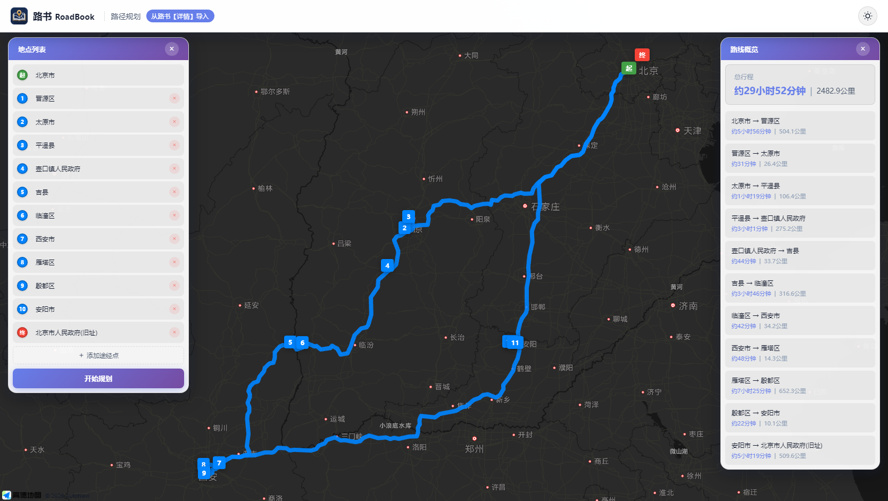

# 路书 RoadBook

<p align="center">
  <strong>将旅行照片转化为交互式轨迹地图</strong>
</p>

<p align="center">
  
</p>

<p align="center">
  <!-- <a href="https://github.com/zangnan/roadbook/stargazers"></a> -->
  <a href="https://github.com/zangnan/roadbook/blob/main/LICENSE"></a>
  
  
  <a href="https://github.com/zangnan/RoadBook/releases/latest"></a>
</p>

---

## 📖 目录

- [项目简介](#-项目简介)
- [功能特性](#-功能特性)
- [快速开始](#-快速开始)
- [使用方式](#-使用方式)
- [技术架构](#-技术架构)
- [项目结构](#-项目结构)
- [配置说明](#-配置说明)
- [API 接口](#-api-接口)
- [常见问题](#-常见问题)
- [许可证](#-许可证)

---

## 🔖 项目简介

路书 RoadBook 是一款**照片 GPS 轨迹可视化工具**，能够从旅行照片的 EXIF 信息中提取 GPS 坐标，自动生成可交互的轨迹地图和时间轴页面。

### 核心价值

- **零门槛**：无需手动标记，照片自带 GPS 信息即可自动生成轨迹
- **离线可用**：生成的 HTML 可完全离线访问，适合分享旅行记忆（仅适合少量照片）
- **跨平台**：支持 Windows 桌面应用和浏览器访问两种方式

### 技术来源

本项目基于 [Claude](https://claude.ai/) 和 [MiniMax](https://minimax.io/) 协助开发。

### 效果展示

<p align="center">
  
  <br/>
  <em>交互式地图1</em>
  <br/><br/>
  
  <br/>
  <em>交互式地图2</em>
  <br/><br/>
  
  <br/><br/>
  <em>交互式地图3</em>
  <br/><br/>
  
  <br/>
  <em>时间轴视图</em>
  <br/><br/>
  
  <br/>
  <em>参数设置</em>

  <br/><br/>
  
  <br/>
  <em>AI路书1</em>
  <br/><br/>
  
  <br/>
  <em>AI路书2</em>
  <br/><br/>
  
  <br/>
  <em>AI路书3</em>
  <br/><br/>
  
  <br/>
  <em>AI路书4</em>
</p>

<!-- 时间轴预览截图（首次运行后生成，可替换此处）
<p align="center">
  
  <br/>
  <em>时间轴视图 · 按日期浏览行程</em>
</p>
-->

---

## ✨ 功能特性

| 特性 | 说明 |
|------|------|
| 📍 **GPS 自动提取** | 从照片 EXIF 信息中提取 GPS 坐标，无需手动标记 |
| 🗺️ **交互式地图** | 基于高德地图，支持缩放、拖拽、点击查看详情 |
| 📅 **时间轴视图** | 按日期分组展示，清晰呈现旅行日程 |
| 🖼️ **照片缩略图** | 自动生成缩略图，支持点击放大查看原图 |
| 📊 **海拔图表** | ECharts 图表展示行程海拔变化 |
| 🔄 **离线分享** | 单 HTML 文件模式，图片 base64 内联，可离线访问 |
| 💾 **智能缓存** | SQLite/JSON 缓存地理编码结果，重复运行大幅加速 |
| 🖥️ **桌面应用** | PyWebView 原生窗口，无需浏览器即可运行 |
| 🚗 **路径规划** | 高德地图路线规划 |
| 🤖 **AI 生成** | 一键生成完整路书，支持 DeepSeek 大模型 |
| 📊 **Excel 导出** | 多 Sheet 行程报表（行程/景点/预算/清单） |
| 🌤️ **天气查询** | 行程期间各目的地天气预报预览 |

### 键盘快捷键（地图页面）

| 按键 | 功能 |
|------|------|
| `Space` | 播放 / 暂停轨迹回放 |
| `←` / `→` | 照片预览上一张 / 下一张照片 |
| `Esc` | 关闭浮层 / 照片预览 |

---

## 🚀 快速开始

### 环境要求

- Python 3.11+
- Windows 10/11

### 方式一：桌面应用（推荐）

1. 下载最新版本的 `roadbook.exe`
2. 双击运行
3. 在界面中选择照片目录，配置参数，点击生成

> 📦 [下载 roadbook.zip](https://github.com/zangnan/roadbook/releases/latest)

### 方式二：从源码运行

#### 1. 克隆项目

```bash
git clone https://github.com/zangnan/roadbook.git
cd roadbook
```

#### 2. 安装依赖

```bash
pip install -r requirements.txt
```

#### 3. 配置 API Key

```bash
copy .env.example .env
```

编辑 `.env` 文件，填入高德地图 API Key：

```env
# 高德地图 Web 端 Key（用于地图展示）
AMAP_WEB_AK=your_web_ak_here

# 高德地图 Web 服务 Key（用于逆地理编码）
AMAP_SERVER_AK=your_server_ak_here
```

> 💡 如何获取高德 API Key：[高德开放平台](https://lbs.amap.com/)

#### 4. 运行

**浏览器端：**
```bash
python src/web_app.py
# 自动打开浏览器访问 http://localhost:18443
```

### 方式三：自行打包

```bash
# 安装 PyInstaller
pip install pyinstaller

# 执行打包
build.bat
```

打包完成后，`dist\roadbook.exe` 即为桌面应用。

---

## 📖 使用方式

### 准备照片

将旅行照片按目录组织，照片必须包含 GPS 信息（大多数智能手机拍照时会自动记录）：

```
photo/
└── my-trip/          ← 照片目录
    ├── IMG_001.jpg
    ├── IMG_002.jpg
    └── IMG_003.jpg
```

### 生成轨迹

**通过 Web 界面：**

1. 打开应用，选择或输入照片目录名
2. 配置参数（可选）：
   - **距离阈值**：相近坐标合并的距离（默认 1000 米）
   - **时间阈值**：相近坐标合并的时间（默认 2 小时）
3. 点击「生成轨迹」
4. 等待处理完成，点击预览查看结果

**通过命令行：**

```bash
python src/photo_track.py my-trip
```

### 参数说明

| 参数 | 说明 | 默认值 |
|------|------|--------|
| `-d, --distance-threshold` | 距离阈值（米） | 1000 |
| `-t, --time-threshold` | 时间阈值（秒） | 7200 |
| `-H, --html-only` | 仅重新生成 HTML（跳过照片解析） | False |
| `-v, --verbose` | 详细日志 | False |

### 输出文件

处理完成后，在 `output/{照片目录名}/` 下生成：

```
output/my-trip/
├── data_original.json          # 原始数据
├── data_converted.json         # 治理后数据
├── data_original_unknown.json  # 无 GPS 信息的照片列表
├── thumbnail/                  # 缩略图
├── track_output.html           # 轨迹地图页面
└── timeline.html               # 时间轴页面
```

### 路径规划

通过路径规划功能，可以使用高德地图规划出行路线：

1. 打开应用，访问 `/route` 页面
2. 输入起点、途经点和终点
3. 点击开始规划，查看路线结果

### AI 生成路书

通过 AI 功能可以一键生成完整路书：

1. 在路书页面点击「AI 生成」
2. 填写行程信息（目的地、天数、人数、房数等）
3. 提交后 AI 自动生成标准 JSON 路书
4. 可进行路径规划、编辑和导出

### Excel 导出

将路书导出为多 Sheet Excel 文件：

1. 在路书页面点击「导出 Excel」
2. 自动生成包含以下 Sheet 的文件：
   - **行程概览**：日期/星期/路线/里程
   - **每日详情**：景点/住宿/美食/ Tips
   - **路线站点**：途经站点列表
   - **景点攻略**：门票/开放时间/游览贴士
   - **预算明细**：交通/住宿/餐饮/门票
   - **出行清单**：分类物品清单

---

## 🏗 技术架构

### 整体架构

```
┌─────────────────────────────────────────────────────────────────┐
│                         用户界面层                               │
│  ┌──────────────┐   ┌──────────────┐   ┌──────────────┐       │
│  │   PyWebView  │   │    浏览器    │   │     CLI      │       │
│  │  桌面应用    │   │   Web 应用   │   │   命令行     │       │
│  └──────┬───────┘   └──────┬───────┘   └──────┬───────┘       │
└─────────┼───────────────────┼───────────────────┼──────────────┘
          │                   │                   │
          └───────────────────┼───────────────────┘
                              ▼
┌─────────────────────────────────────────────────────────────────┐
│                      Flask Web 服务层                            │
│              src/web_app.py / src/desktop_app.py                │
│  ┌─────────────────────────────────────────────────────────┐    │
│  │              任务调度 (threading)                        │    │
│  │              静态文件服务                                 │    │
│  │              API 路由 (/api/run, /api/status)           │    │
│  └─────────────────────────────────────────────────────────┘    │
└─────────────────────────────┬───────────────────────────────────┘
                              ▼
┌─────────────────────────────────────────────────────────────────┐
│                     业务逻辑层 (src/)                             │
│  ┌─────────────┐  ┌─────────────┐  ┌─────────────┐            │
│  │  EXIF 读取  │→ │ 地理编码     │→ │ 坐标合并     │            │
│  │             │  │ (带缓存)     │  │ 轨迹分段     │            │
│  └─────────────┘  └─────────────┘  └─────────────┘            │
│                              │                                   │
│                              ▼                                   │
│                     ┌─────────────┐                              │
│                     │ HTML 生成   │                              │
│                     │ Jinja2 模板 │                              │
│                     └─────────────┘                              │
└─────────────────────────────────────────────────────────────────┘
```

### 数据流程

```
照片文件 (JPG/PNG/HEIC)
       │
       ▼
┌─────────────────┐
│  EXIF GPS 提取  │  ← exif_reader.py
│  缩略图生成      │  ← thumbnail.py
└────────┬────────┘
         │
         ▼
┌─────────────────┐
│  逆地理编码     │  ← 高德 API + SQLite 缓存
│  (坐标→地点名)  │
└────────┬────────┘
         │
         ▼
┌─────────────────┐
│  坐标合并       │  ← 距离+时间双阈值
│  轨迹分段       │  ← 按日期分组
└────────┬────────┘
         │
         ▼
┌─────────────────┐
│  HTML 生成      │  ← Jinja2 模板
│  (地图/时间轴)  │
└─────────────────┘
```

### 技术栈

| 库 | 版本 | 用途 |
|----|------|------|
| [Flask](https://flask.palletsprojects.com/) | >=2.0 | Web 框架 |
| [Jinja2](https://jinja.palletsprojects.com/) | - | 模板引擎（Flask 内置） |
| [Pillow](https://pillow.readthedocs.io/) | >=9.0 | 图片处理 |
| [exifread](https://github.com/ianare/exifread) | >=3.0 | EXIF 信息读取 |
| [python-dotenv](https://pypi.org/project/python-dotenv/) | >=0.19 | 环境变量加载 |
| [requests](https://requests.readthedocs.io/) | >=2.28 | HTTP 请求 |
| [PyWebView](https://pywebview.flowrl.com/) | >=5.0 | 桌面应用框架 |
| [openpyxl](https://openpyxl.readthedocs.io/) | >=3.0 | Excel 文件生成 |
| 高德地图 JavaScript API | - | 地图展示 |
| SQLite / JSON | - | 数据缓存 |
| PyInstaller | >=6.0 | 打包工具 |

---

## 📁 项目结构

```
roadbook/
├── .env.example          # 环境变量模板
├── .gitignore
├── build.bat             # 打包脚本
├── requirements.txt      # Python 依赖
├── roadbook.spec         # PyInstaller 配置
│
├── src/                  # 源代码目录
│   ├── __init__.py
│   ├── config.py         # 配置文件
│   ├── photo_track.py    # CLI 主入口
│   ├── track_generator.py # 轨迹生成核心逻辑
│   ├── web_app.py         # Web 应用入口
│   ├── desktop_app.py     # 桌面应用入口
│   ├── exif_reader.py     # EXIF 读取
│   ├── coord_converter.py # 坐标转换
│   ├── thumbnail.py       # 缩略图生成
│   ├── geo_coder.py       # 地理编码
│   ├── route_planner.py   # 路径规划（高德API）
│   ├── ai_generator.py    # AI 路书生成（DeepSeek）
│   ├── excel_exporter.py  # Excel 导出
│   └── weather.py         # 天气查询
│
├── templates/
│   ├── map_template.html      # 轨迹地图模板
│   ├── timeline_template.html # 时间轴模板
│   ├── config_template.html   # 配置页面模板
│   ├── home_template.html     # 首页模板
│   ├── route_template.html   # 路径规划页面
│   └── roadbook_template.html # 路书展示页面
│
├── static/
│   ├── app.js            # 应用脚本
│   ├── map.css           # 地图样式
│   ├── style.css         # 界面样式
│   ├── common.css        # 通用样式（主题/动画/悬浮球）
│   ├── route.css         # 路径规划样式
│   └── assets/           # 静态资源
│       ├── app.ico       # 应用图标
│       ├── favicon-*.png # 多尺寸图标
│       ├── car.png       # 车辆图标
│       ├── dir-marker.png # 地点标记图标
│       └── preview-*.png # 预览图
│
├── docs/                 # 文档目录
│   ├── route.md          # 路书示例
│   ├── route_example.json # 路书 JSON 示例
│   └── route_template.json # 路书 JSON Schema
│
├── photo/                # 照片目录（可配置）
├── output/               # 输出目录（可配置）
│   └── {photo_dir}/
│       ├── track_output.html
│       └── timeline.html
│
└── cache/               # 缓存目录
    └── cache.db         # SQLite 缓存
```

---

## ⚙️ 配置说明

### 环境变量 (.env)

| 变量 | 说明 | 默认值 |
|------|------|--------|
| `AMAP_WEB_AK` | 高德 Web 端 Key（地图展示） | - |
| `AMAP_SERVER_AK` | 高德 Web 服务 Key（地理编码） | - |
| `ORIGINAL_IMAGE_QUALITY` | 原图压缩质量 (1-100) | `50` |
| `DISTANCE_THRESHOLD` | 坐标合并距离阈值（米） | `1000` |
| `TIME_THRESHOLD` | 坐标合并时间阈值（秒） | `7200` |
| `CACHE_TYPE` | 缓存类型 (`sqlite` / `json`) | `sqlite` |
| `PHOTO_BASE_DIR` | 照片根目录 | `photo` |
| `OUTPUT_BASE_DIR` | 输出根目录 | `output` |
| `WEB_PORT` | 网页端端口 | `18443` |
| `DESKTOP_PORT` | 桌面端端口 | `12255` |

### 路径配置

支持绝对路径和相对路径：

```env
# 绝对路径
PHOTO_BASE_DIR=D:\RoadBook\photo
OUTPUT_BASE_DIR=D:\RoadBook\output

# 相对路径（\photo 表示相对于 exe 所在目录）
PHOTO_BASE_DIR=\photo
OUTPUT_BASE_DIR=\output
```

---

## 🌐 API 接口

| 路由 | 方法 | 说明 |
|------|------|------|
| `/api/directories` | GET | 获取照片目录列表 |
| `/api/outputs` | GET | 获取输出目录列表 |
| `/api/run` | POST | 执行轨迹生成任务 |
| `/api/status/<task_id>` | GET | 查询任务状态 |
| `/api/route/inputtips` | GET | 地点搜索（高德） |
| `/api/route/plan` | POST | 路径规划（高德） |
| `/api/ai/generate` | POST | AI 生成路书 |
| `/api/export/excel` | POST | Excel 导出 |
| `/api/weather` | GET | 天气查询 |
| `/output/<path>` | GET | 访问输出文件 |

---

## ❓ 常见问题

### Q: 照片没有 GPS 信息怎么办？

A: 路书依赖照片的 EXIF GPS 信息。如果照片没有 GPS 数据，可以：
1. 检查手机拍照设置，确保开启了位置信息记录。

### Q: 提示 "高德 Web 服务 Key 未配置"？

A: 需要在 `.env` 文件中配置 `AMAP_SERVER_AK`。没有此 Key 逆地理编码功能不可用，但轨迹地图仍可生成（只是地点名称可能显示为坐标）。

### Q: 桌面应用显示黑屏或无法加载？

A: 尝试以下步骤：
1. 检查 `.env` 文件是否存在且配置正确
2. 确保 `photo`、`output`、`cache` 目录存在
3. 查看命令行是否有错误信息输出

### Q: 如何更新桌面应用？

A: 下载新版本覆盖 `roadbook.exe`，`.env` 配置文件和 `photo`、`output` 数据目录不受影响。

### Q: 生成的 HTML 能分享给别人吗？

A: 可以！将 `SINGLE_HTML_OUTPUT` 设置为 `True` 后，生成的 HTML 文件包含所有图片 base64 数据，可完全离线访问，直接发送文件即可。

---

## 📄 许可证

本项目基于 [MIT License](LICENSE) 开源。

---

<p align="center">
  <strong>路书 RoadBook</strong> · 将旅行记忆可视化
  <br/>
  <a href="https://github.com/zangnan/roadbook">GitHub</a> · <a href="https://github.com/zangnan/roadbook/issues">反馈问题</a>
</p>
